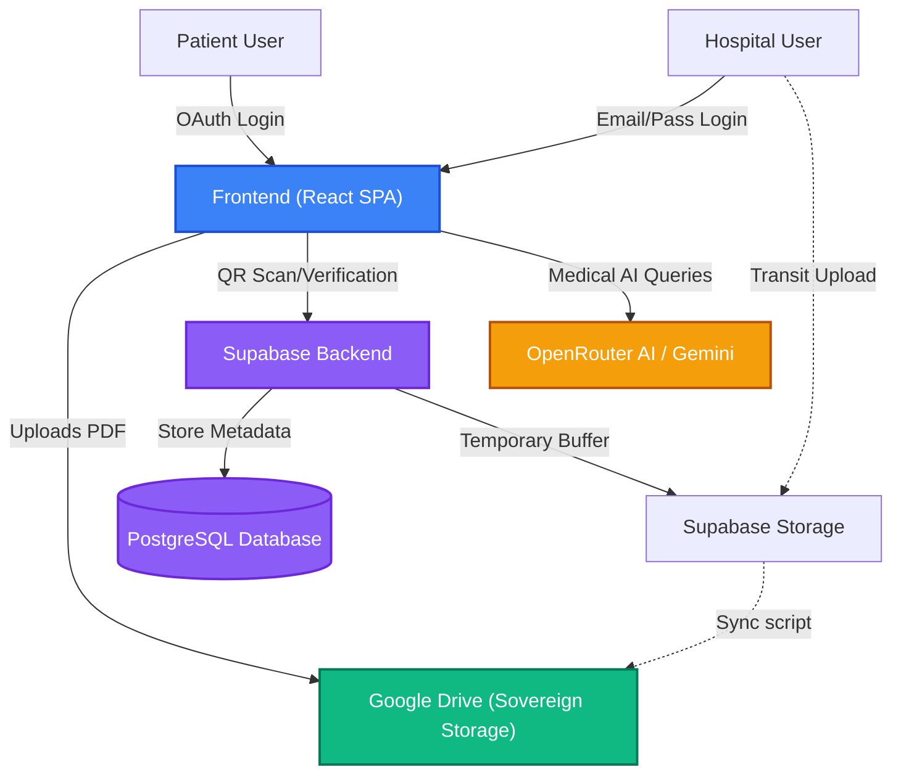
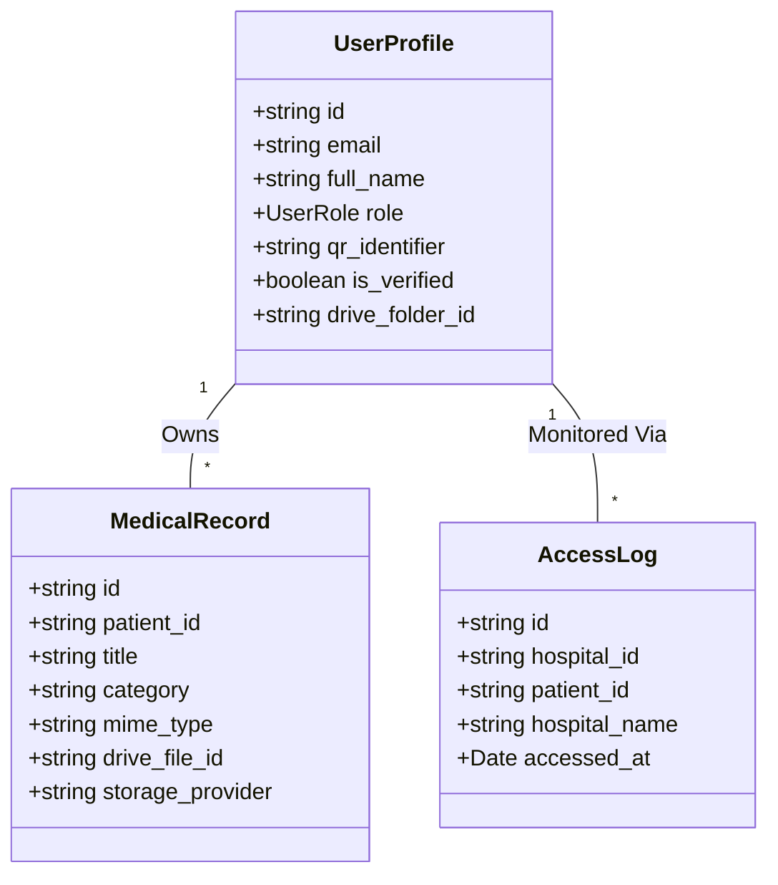
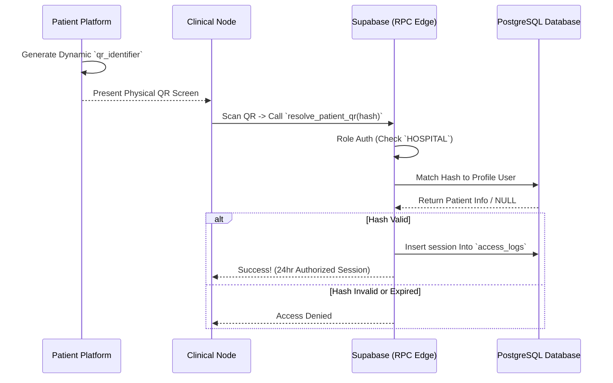
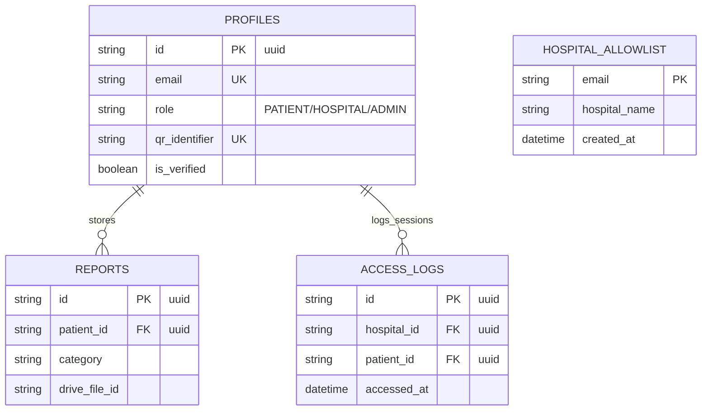
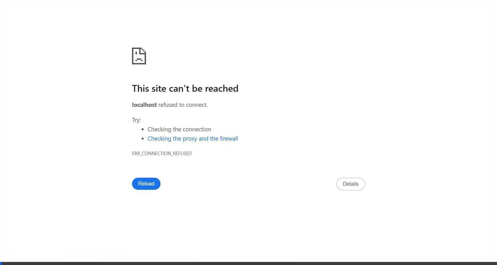
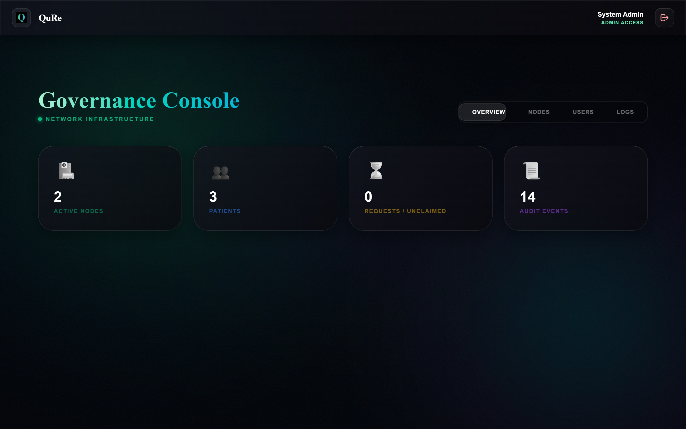
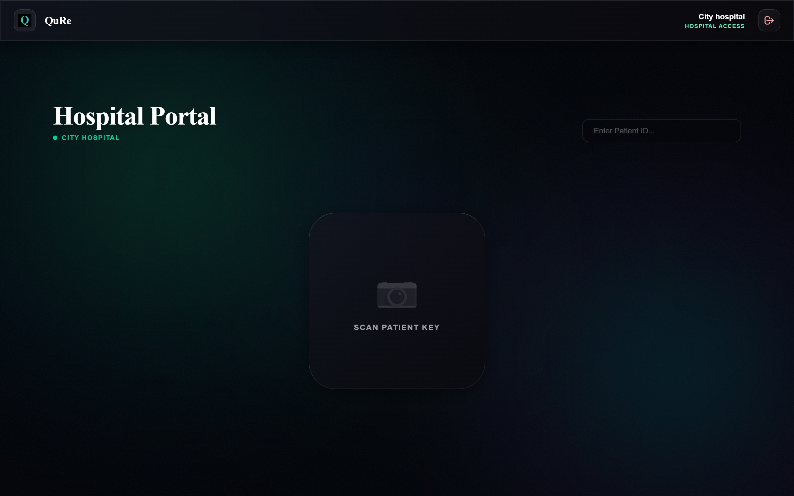
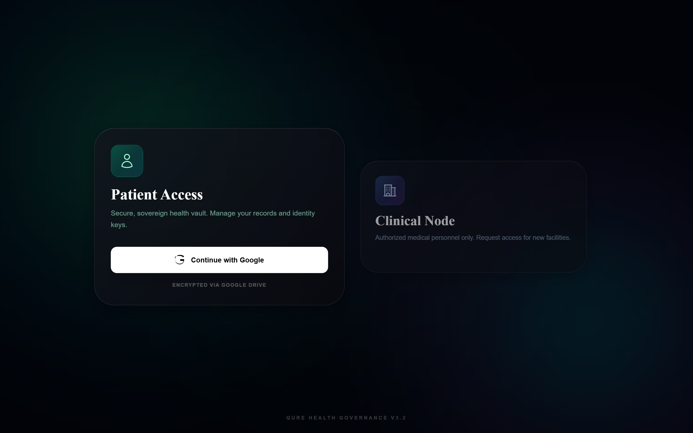

# QuRe: Sovereign Health Identity

**🌍 Live Preview:** [https://qure.netlify.app](https://qure.netlify.app)

QuRe is a next-generation decentralized health data platform. It flips the traditional siloed medical model by putting the patient at the center of the network. QuRe empowers patients with absolute sovereignty over their medical records while providing healthcare professionals with secure, frictionless access via dynamic QR handshakes. 

Powered by **OpenRouter API** (running Gemini 2.5 Pro or other advanced models), QuRe also features an intelligent Health Concierge to help patients understand their medical history.

---

## 🌟 Core Philosophy

Traditional healthcare systems lock patient data across multiple disconnected providers. In QuRe, the patient is the central node:
1. Records are encrypted and stored directly in the patient's personal Google Drive vault. 
2. Hospitals and clinics (Clinical Nodes) must request access via a physical, securely generated QR scan.
3. Once the consultation ends, the session is terminated, ensuring data is only shared with explicit, present consent.

---

## 🏗️ System Architecture

QuRe employs a hybrid decentralized architecture, separating heavy encrypted storage from lightweight metadata and authentication layers.



### 🧬 Domain Class Diagram



### 🔐 QR Handshake Protocol (Sequence)



### 🗄️ Unified Entity Relationship Diagram (UML/DB)



---

## 📸 Screenshots & Demo

Watch the QuRe Sovereign Health Node in action below, demonstrating the landing sequence and the Clinical Node interface:

<div align="center">
  
</div>

---

## 🔬 AI Concierge Pipeline

QuRe leverages an advanced pipeline to synthesize and analyze medical records securely. The process ensures that raw data is transformed into actionable intelligence without compromising sovereignty.

1. **Document Ingestion:** Patients or Clinical Nodes upload medical files (e.g., physiological reports, lab results, imaging like Brain CTs and Kidney MRIs).
2. **Client-Side Standardization:** Before any data leaves the device, it is sanitized and formatted into a standardized PDF securely within the browser.
3. **Sovereign Vault Storage:** Data is encrypted and uploaded directly to the patient's Google Drive. QuRe servers only retain the metadata pointer.
4. **Context Window Generation:** When the patient queries the Health Concierge, the frontend dynamically pulls the relevant records from the vault, converts them into an optimized prompt, and opens a secure session with OpenRouter AI (Gemini 2.5 Pro).
5. **Insights Delivery:** The AI Concierge streams clinically contextualized answers directly to the patient's interface.

---

## 📊 Pipeline Results & Capability

QuRe's Health Concierge can synthesize complex imaging and reports. The platform supports diverse medical data analysis.

Below are sample imaging records processed dynamically through the QuRe pipeline:

<div align="center">
  <div style="display: flex; gap: 20px; justify-content: center; align-items: center;">
    <figure style="margin: 0;">
      
      <figcaption align="center"><i>Processed Brain CT Scan</i></figcaption>
    </figure>
    <figure style="margin: 0;">
      
      <figcaption align="center"><i>Processed Kidney MRI</i></figcaption>
    </figure>
  </div>
</div>

### 📸 Platform Interfaces

Watch the complete **Live Platform Interaction Demo:**

<video src="https://github.com/sathwik-70/QuRe/raw/main/demo/qure_demo.mp4" controls width="100%" style="max-width: 800px;"></video>

<br/>

**1. Landing & Authentic Flow**


**2. Sovereign Unified Patient Vault**


**3. Clinical Hub Integration**


---

## ✨ Features & Functionality

### 👤 Patient Portal (The Sovereign Vault)
* **Sovereign Storage Integration:** Medical records are standardized to PDF by the frontend and uploaded directly into the user's personal Google Drive (`QURE records` folder). QuRe only stores metadata.
* **Dynamic Identity Key:** A secure, auto-refreshing QR code acts as the patient's universal health identifier. It rotates its timestamp signature every 30 seconds to prevent replay attacks.
* **AI Health Concierge:** Powered by the OpenRouter API, the concierge analyzes the patient's existing medical ledger to answer health queries, summarize complex records, and provide clinical context.
* **Unified Ledger Dashboard:** View all medical records, prescriptions, and imaging reports in one place.

### 🏥 Clinical Node (Provider Dashboard)
* **Role-Based Access:** Verified medical personnel can log in via email and password to the Clinical Node after admin approval.
* **QR Handshake Protocol:** Providers use their device camera to scan a patient's dynamic Identity Key. A secure Supabase RPC function (`resolve_patient_qr`) validates the scan and establishes a temporary authorized session without exchanging passwords.
* **Direct-to-Vault Uploads:** Providers can upload new lab results, clinical notes, or prescriptions. The files are standardized, uploaded to secure transit storage, and injected into the patient's sovereign vault.
* **Session Management:** Built-in session tracking automatically times out inactive connections to ensure data privacy after the patient leaves the consultation room.

### 🛡️ Admin Node (Governance & Audit)
* **Hospital Registry:** Administrators review requests and approve verified medical facilities to join the network.
* **Immutable Audit Logs:** Every time a patient's record is accessed or modified by a hospital, it is logged in an immutable ledger tracking the hospital ID, patient ID, and timestamp.
* **Network Integrity:** Oversee patient and provider populations to maintain a secure ecosystem.

---

## 🛠️ Technology Stack

The QuRe platform is built entirely as a high-performance, serverless Single Page Application (SPA).

### Frontend & UI
* **React 19:** The core UI library.
* **TypeScript:** For strict type safety and interface definitions (`types.ts`).
* **Vite (v6):** Ultra-fast frontend build tooling and local development server.
* **Tailwind CSS 4:** Used for the premium "Glassmorphism" aesthetic, HD gradients, and complex CSS micro-animations.

### Backend, Database & Authentication
* **Supabase:** The backend-as-a-service platform powering QuRe.
  * **Auth:** Google OAuth for Patient logins; Email/Password for Hospital authentication.
  * **Database (PostgreSQL):** Stores relational data (user profiles, record metadata, audit logs). Relies heavily on **Row Level Security (RLS)** and **Remote Procedure Calls (RPC)** to securely orchestrate the QR handshake between isolated user accounts.
  * **Storage:** Temporary transit buckets for file uploads.

### Decentralized Storage 
* **Google Drive API:** The primary storage mechanism. Patients authenticate via Google OAuth, granting QuRe the exact scopes needed to save PDFs directly into their unified cloud drive.

### Artificial Intelligence
* **OpenRouter API:** Powers the QuRe Health Concierge using a multi-model proxy (e.g., `google/gemini-2.5-pro`). It reads a sanitized context of the patient's health ledger to provide conversational, medically-responsible insights.

### Core Utilities
* **jsQR:** Real-time decoding of QR matrices from live video camera feeds.
* **qrcode:** High-density HTML canvas generation of the patient's rotating Identity Key.
* **jsPDF:** Client-side conversion and standardization of images/text into secure PDF formats before vault injection.

---

## 🗄️ Database Schema & Security

QuRe relies on PostgreSQL with strict **Row Level Security (RLS)** to enforce zero-trust policies. No user can query the database for another user's records without an active cryptographic session.

```sql
-- Core Profiles
Table: profiles
- id (uuid, matched to auth.users)
- email (text)
- role (enum: PATIENT, HOSPITAL, ADMIN)
- qr_identifier (text, dynamic hash)
- is_verified (boolean)

-- Medical Ledger (Metadata)
Table: reports
- id (uuid)
- patient_id (uuid, foreign key)
- title, category, mime_type
- drive_file_id (text, pointer to sovereign storage)

-- Immutable Audit
Table: access_logs
- id (uuid)
- hospital_id (uuid)
- patient_id (uuid)
- accessed_at (timestamptz)
```

### 🔐 Remote Procedure Calls (RPC)
The application utilizes secure RPCs to handle sensitive transactions entirely on the backend:
* `resolve_patient_qr`: Verifies a hospital's scanned QR code and returns a temporary session token.
* `create_clinical_report`: Allows a hospital to inject a new record into a patient's pending queue.

---

## 🚀 Local Development Setup

### Prerequisites
* Node.js (v18+ recommended)
* npm or yarn
* Supabase Project (URL & Anon Key)
* OpenRouter API Key
* Google Cloud Console Project (configured for Drive API & Google OAuth Client ID)

### 1. Clone & Install
```bash
git clone https://github.com/sathwik-70/QuRe.git
cd QuRe
npm install
```

### 2. Environment Configuration
Create a `.env` file in the root directory:

```env
VITE_SUPABASE_URL=https://your-project-id.supabase.co
VITE_SUPABASE_ANON_KEY=your-anon-key
OPENROUTER_API_KEY=your-openrouter-api-key
```

### 3. Start Development Server
```bash
npm run dev
```
The application will be available at `http://localhost:5173`.

---

## 🌍 Deployment (Netlify)

This project is fully configured for seamless deployment to Netlify as a static frontend application, utilizing CI/CD pipelines.

1. **Build Configuration (`netlify.toml`):** The repository includes configuration to bypass Netlify's secret scanners. Because QuRe is fully decentralized, the Supabase and OpenRouter keys are safely compiled into the client bundle.
2. **Environment Variables:** In your Netlify dashboard, provide:
   * `VITE_SUPABASE_URL`
   * `VITE_SUPABASE_ANON_KEY`
   * `OPENROUTER_API_KEY`
3. **Routing:** The `public/_redirects` file is included to ensure that React Router handles SPA navigation without throwing 404 errors on refresh.

---

## 🔭 Future Scope

QuRe is designed as a foundational protocol. Future iterations will include:
* **Web3/Blockchain Integration:** Moving the metadata ledger from PostgreSQL to an L2 blockchain (e.g., Polygon) for absolute cryptographic immutability.
* **Biometric Auth Integration:** Enhancing the QR handshake with WebAuthn or FaceID requirements.
* **Emergency Override Protocol:** A time-locked mechanism for first-responders to access critical blood-type and allergy info without a QR handshake.
* **Wearable Integrations:** Continuous injection of Apple Health/Google Fit vitals into the ledger.

---

## ⚠️ Medical Disclaimer

**QuRe is a technology demonstration.** The AI Concierge is designed for informational purposes only and does not constitute professional medical advice, diagnosis, or treatment. Always seek the advice of your physician or other qualified health provider with any questions you may have regarding a medical condition. Never disregard professional medical advice or delay in seeking it because of something you have read on this application.

---
*Built with React, Supabase, and OpenRouter.*
